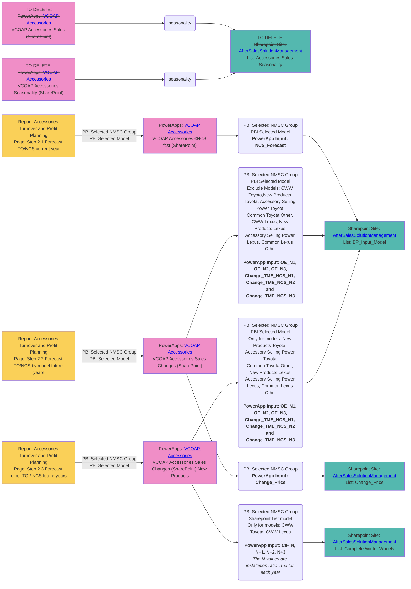

```mermaid
graph LR
    PBI_Acc__2_1["Report: Accessories Turnover and Profit Planning<br>Page: Step 2.1 Forecast TO/NCS current year"]
    PBI_Acc__2_2["Report: Accessories Turnover and Profit Planning<br>Page: Step 2.2 Forecast TO/NCS by model future years"]
    PBI_Acc__2_3["Report: Accessories Turnover and Profit Planning<br>Page: Step 2.3 Forecast other TO / NCS future years"]

    PowerApp_Acc__2_1["PowerApps: <a href='https://make.powerapps.com/environments/Default-52b742d1-3dc2-47ac-bf03-609c83d9df9f/search?q=Accessories' target='_blank'>VCOAP Accessories</a><br>VCOAP Accessories €NCS fcst (SharePoint)"]
    PowerApp_Acc__2_2["PowerApps: <a href='https://make.powerapps.com/environments/Default-52b742d1-3dc2-47ac-bf03-609c83d9df9f/search?q=Accessories' target='_blank'>VCOAP Accessories</a><br>VCOAP Accessories Sales Changes (SharePoint)"]
    PowerApp_Acc__2_3["PowerApps: <a href='https://make.powerapps.com/environments/Default-52b742d1-3dc2-47ac-bf03-609c83d9df9f/search?q=Accessories' target='_blank'>VCOAP Accessories</a><br>VCOAP Accessories Sales Changes (SharePoint) New Products"]
    PowerApp_Acc__2_4["TO DELETE:<br><strike>PowerApps: <a href='https://make.powerapps.com/environments/Default-52b742d1-3dc2-47ac-bf03-609c83d9df9f/search?q=Accessories' target='_blank'>VCOAP Accessories</a><br>VCOAP Accessories Sales (SharePoint)"]
    PowerApp_Acc__2_5["TO DELETE:<br><strike>PowerApps: <a href='https://make.powerapps.com/environments/Default-52b742d1-3dc2-47ac-bf03-609c83d9df9f/search?q=Accessories' target='_blank'>VCOAP Accessories</a><br>VCOAP Accessories Seasonality (SharePoint)"]

    SharepointList_Acc__2_1["Sharepoint Site: <a href='https://toyotaeu.sharepoint.com/sites/AfterSalesCollaborativePlatform/AfterSalesSolutionManagement' target='_blank'>AfterSalesSolutionManagement</a><br>List: BP_Input_Model"]
    SharepointList_Acc__2_2["Sharepoint Site: <a href='https://toyotaeu.sharepoint.com/sites/AfterSalesCollaborativePlatform/AfterSalesSolutionManagement' target='_blank'>AfterSalesSolutionManagement</a><br>List: Change_Price"]
    SharepointList_Acc__2_3["Sharepoint Site: <a href='https://toyotaeu.sharepoint.com/sites/AfterSalesCollaborativePlatform/AfterSalesSolutionManagement' target='_blank'>AfterSalesSolutionManagement</a><br>List: Complete Winter Wheels"]
    SharepointList_Acc__2_4["TO DELETE:<br><strike>Sharepoint Site: <a href='https://toyotaeu.sharepoint.com/sites/AfterSalesCollaborativePlatform/AfterSalesSolutionManagement' target='_blank'>AfterSalesSolutionManagement</a><br>List: Accessories Sales Seasonality"]

    PBI_Acc__2_1 --> |"PBI Selected NMSC Group<br>PBI Selected Model"| PowerApp_Acc__2_1
    PBI_Acc__2_2 --> |"PBI Selected NMSC Group<br>PBI Selected Model"| PowerApp_Acc__2_2
    PBI_Acc__2_3 --> |"PBI Selected NMSC Group<br>PBI Selected Model"| PowerApp_Acc__2_3
    
    PowerApp_Acc__2_1 --> input1("PBI Selected NMSC Group<br>PBI Selected Model<br><b>PowerApp Input: NCS_Forecast</b>") --> SharepointList_Acc__2_1
    PowerApp_Acc__2_2 --> input2("PBI Selected NMSC Group<br>PBI Selected Model<br>Exclude Models: CWW Toyota,New Products Toyota, Accessory Selling Power Toyota,<br>Common Toyota Other, CWW Lexus, New Products Lexus,<br>Accessory Selling Power Lexus, Common Lexus Other<br><br><b>PowerApp Input: OE_N1, OE_N2, OE_N3,<br>Change_TME_NCS_N1, Change_TME_NCS_N2<br>and Change_TME_NCS_N3</b>") --> SharepointList_Acc__2_1
    PowerApp_Acc__2_2 --> input3("PBI Selected NMSC Group<br><b>PowerApp Input: Change_Price</b>") --> SharepointList_Acc__2_2
    PowerApp_Acc__2_3 --> input4("PBI Selected NMSC Group<br>PBI Selected Model<br>Only for models: New Products Toyota, Accessory Selling Power Toyota,<br>Common Toyota Other, New Products Lexus,<br>Accessory Selling Power Lexus, Common Lexus Other<br><br><b>PowerApp Input: OE_N1, OE_N2, OE_N3,<br>Change_TME_NCS_N1, Change_TME_NCS_N2<br>and Change_TME_NCS_N3</b>") --> SharepointList_Acc__2_1
    PowerApp_Acc__2_3 --> input5("PBI Selected NMSC Group<br>Sharepoint List model<br> Only for models: CWW Toyota, CWW Lexus<br><br><b>PowerApp Input: CIF, N, N+1, N+2, N+3</b><br><i>The N values are installation ratio in % for each year</i>") --> SharepointList_Acc__2_3
    PowerApp_Acc__2_4 --> input6("<strike>seasonality") --> SharepointList_Acc__2_4
    PowerApp_Acc__2_5 --> input7("<strike>seasonality") --> SharepointList_Acc__2_4

    click PBI_Acc__2_1 "https://app.powerbi.com/groups/d35e6402-b4f4-4d44-b2dc-60c4c7a9527d/reports/15b942af-3802-4b18-8df5-26f86d673587/ReportSectiona23921682f0a3e7fa8c8" "Accessories Turnover and Profit Planning > Step 2.1 Forecast TO/NCS current year"
    click PBI_Acc__2_2 "https://app.powerbi.com/groups/d35e6402-b4f4-4d44-b2dc-60c4c7a9527d/reports/15b942af-3802-4b18-8df5-26f86d673587/ReportSectiona24642467f1b62257bf4" "Accessories Turnover and Profit Planning > Step 2.2 Forecast TO/NCS by model future years"
    click PBI_Acc__2_3 "https://app.powerbi.com/groups/d35e6402-b4f4-4d44-b2dc-60c4c7a9527d/reports/15b942af-3802-4b18-8df5-26f86d673587/ReportSection82049d9079ec235c281b" "Accessories Turnover and Profit Planning > Step 2.3 Forecast other TO / NCS future years"
    
    click PowerApp_Acc__2_1 "https://make.powerapps.com/environments/Default-52b742d1-3dc2-47ac-bf03-609c83d9df9f/apps/e88bbdcf-ce47-482a-bd1d-39ae76b63a85/details?utm_source=office&amp;utm_medium=app_launcher&amp;utm_campaign=office_referrals" "PowerApp VCOAP Accessories €NCS fcst (SharePoint)"
    click PowerApp_Acc__2_2 "https://make.powerapps.com/environments/Default-52b742d1-3dc2-47ac-bf03-609c83d9df9f/apps/568b8681-2f3f-4e00-a6cd-95c7618d234f/details?utm_source=office&amp;utm_medium=app_launcher&amp;utm_campaign=office_referrals" "VCOAP Accessories Sales Changes (SharePoint)"
    click PowerApp_Acc__2_3 "https://make.powerapps.com/environments/Default-52b742d1-3dc2-47ac-bf03-609c83d9df9f/apps/266e69d6-8be3-4509-b2f0-7d023a61174f/details?utm_source=office&amp;utm_medium=app_launcher&amp;utm_campaign=office_referrals" "VCOAP Accessories Sales Changes (SharePoint) New Products"
    click PowerApp_Acc__2_4 "https://make.powerapps.com/environments/Default-52b742d1-3dc2-47ac-bf03-609c83d9df9f/apps/b5d38431-ad82-4d1a-9efb-164a69e20e30/details" "VCOAP Accessories Sales (SharePoint)"
    click PowerApp_Acc__2_5 "https://make.powerapps.com/environments/Default-52b742d1-3dc2-47ac-bf03-609c83d9df9f/apps/16d19bc9-e141-4f01-bf31-a33dd8471503/details" "VCOAP Accessories Seasonality (SharePoint)"

    click SharepointList_Acc__2_1 "https://toyotaeu.sharepoint.com/sites/AfterSalesCollaborativePlatform/AfterSalesSolutionManagement/Lists/BP_Input_Model/AllItems.aspx?env=WebViewList" "Sharepoint List: AfterSalesSolutionManagement > BP_Input_Model"
    click SharepointList_Acc__2_2 "https://toyotaeu.sharepoint.com/sites/AfterSalesCollaborativePlatform/AfterSalesSolutionManagement/Lists/Change_Price/AllItems.aspx?env=WebViewList" "Sharepoint List: AfterSalesSolutionManagement > Change_Price"
    click SharepointList_Acc__2_3 "https://toyotaeu.sharepoint.com/sites/AfterSalesCollaborativePlatform/AfterSalesSolutionManagement/Lists/Complete%20Winter%20Wheels/AllItems.aspx?env=WebViewList" "Sharepoint List: AfterSalesSolutionManagement > Complete Winter Wheels"
    click SharepointList_Acc__2_4 "https://toyotaeu.sharepoint.com/sites/AfterSalesCollaborativePlatform/AfterSalesSolutionManagement/Lists/Accessories%20Sales%20Seasonality/AllItems.aspx?env=WebViewList" "Sharepoint List: AfterSalesSolutionManagement > Accessories Sales Seasonality"

    style PBI_Acc__2_1 fill:#FAD058
    style PBI_Acc__2_2 fill:#FAD058
    style PBI_Acc__2_3 fill:#FAD058
    
    style PowerApp_Acc__2_1 fill:#F08EC7
    style PowerApp_Acc__2_2 fill:#F08EC7
    style PowerApp_Acc__2_3 fill:#F08EC7
    style PowerApp_Acc__2_4 fill:#F08EC7
    style PowerApp_Acc__2_5 fill:#F08EC7

    style SharepointList_Acc__2_1 fill:#54B8AF
    style SharepointList_Acc__2_2 fill:#54B8AF
    style SharepointList_Acc__2_3 fill:#54B8AF
    style SharepointList_Acc__2_4 fill:#54B8AF;
```